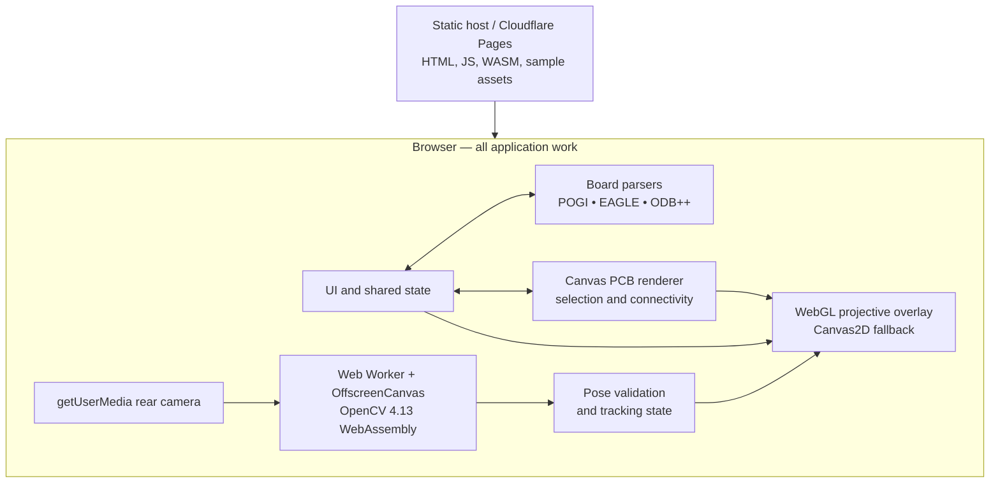
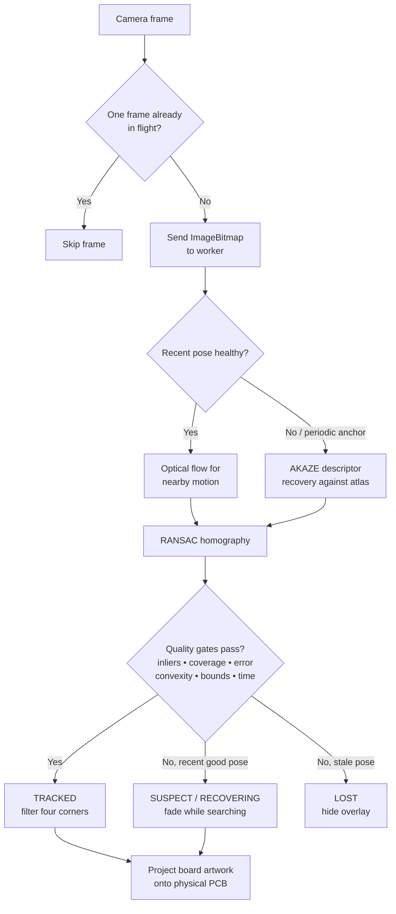

# AR-DUINO

> A browser-based PCB viewer that turns a physical board into an interactive inspection surface through on-device, markerless augmented reality.

   

<p align="center">
  
</p>

<!-- Screenshot placeholder: add a wide desktop image showing the loaded Arduino board, layers panel, and selected component. Suggested path: docs/assets/overview.png -->

## The idea

Inspecting a PCB usually means switching attention between a physical board, a board viewer, component references, and an inspection checklist. AR-DUINO explores a more direct workflow: keep the board in view, recognize it from the phone camera, and project the same board data back onto the real hardware.

The project is deliberately built as a static web application. Board rendering, file parsing, camera access, tracking, and overlay composition run in the browser; a deployment only serves the app and its assets. That keeps the demo easy to host and avoids sending live camera frames to a server.

## Showcase

<!-- APNG placeholder: add a short, looping capture of calibration, tracking, and a selected inspection step. Suggested path: docs/assets/ar-inspection-flow.apng -->

| Area | What the current prototype demonstrates |
| --- | --- |
| PCB viewer | Renders bundled Arduino UNO and MEGA 2560 examples, with pan, zoom, layer controls, selection, and connectivity highlighting. |
| Board formats | Parses JSON, EAGLE XML/ZIP, and ODB++ ZIP in the browser. The public demo currently exposes bundled samples; the generic board-upload path remains disabled in the UI. |
| AR calibration | Uses a four-corner physical-board selection, with an optional bounded edge-detection assist and preview before the reference is applied. |
| Markerless tracking | Combines AKAZE feature recovery with pyramidal Lucas–Kanade optical flow, then accepts a pose only after geometric and temporal validation. |
| Inspection workflow | Lets a user assemble, save, load, navigate, pass, or flag a component/net inspection sequence. AR can isolate the active sequence target. |
| Privacy and diagnostics | Keeps vision work on-device. The developer view can visualize tracking points and live quality data without exposing camera frames. |

## A representative flow

```mermaid
flowchart LR
    A[Open a bundled board sample] --> B[Explore board data\ncomponents, nets, layers]
    B --> C[Create or load\nan inspection sequence]
    C --> D[Open AR camera\non an HTTPS origin]
    D --> E[Place four board corners\nand review optional edge assist]
    E --> F[Calibrate a canonical\nboard reference]
    F --> G[Track the physical PCB\non device]
    G --> H[Project current selection\nor active sequence step]
    H --> I[Pass, flag, or move\nto the next step]
```



## How the system is put together



The flat viewer and the AR mode share one board model and selection state. A net or component selected in either surface is therefore the same selection, not a second AR-only data model.

## Tracking logic



Read the detailed explanation in [AR tracking architecture](docs/ar-tracking-architecture.md). It distinguishes implemented behavior from future directions and documents the performance and tracking limits that matter in real use.

## Current scope and honest limits

AR-DUINO is an active prototype intended to demonstrate a practical inspection interaction, not a production inspection system. Its strongest conditions are a flat, visually distinctive board under diffuse light, with the full outline visible and the camera reasonably focused.

- The tracker is markerless and planar. It is not a full 3D reconstruction system: tall components, lens distortion, heavy reflections, motion blur, severe occlusion, or an almost edge-on view can degrade or defeat the pose.
- The synthetic recovery atlas improves large-angle recovery but cannot reproduce every real lighting or parallax condition. Real-device and replay validation with the intended board and operating environment are still required before operational use.
- The shipped demo is sample-first. It loads the included Arduino boards; importing arbitrary boards is implemented in the parsing layer but intentionally disabled in the current interface.
- Camera access needs HTTPS on phones. `localhost` is trusted only on the machine running the server.
- Browser and device support varies. AR mode needs Web Workers, `createImageBitmap`, `OffscreenCanvas`, WebAssembly, and a usable camera; WebGL improves projection but has a Canvas2D fallback.

## Technology choices

- **Vite + vanilla ES modules** for a small, transparent static application.
- **Canvas2D** for the PCB viewer, hit testing, and a rendering fallback.
- **OpenCV 4.13 WebAssembly** in a classic worker for markerless feature tracking without a backend.
- **AKAZE + RANSAC homography** for global recovery and **pyramidal Lucas–Kanade flow** for fast, local motion updates.
- **WebGL** for an exact projective overlay when available.
- **Browser-native ZIP processing** for EAGLE/ODB++ inputs and **local browser storage** for UI preferences.
- **Node’s built-in test runner** for focused model, parser, camera, tracking-geometry, and renderer regression tests.

## Project structure

```text
src/
├── ar/             Camera lifecycle, calibration, tracking worker, diagnostics, overlay
├── model/          Board normalization, connectivity, inspection-sequence model
├── parsers/        POGI, EAGLE, ODB++, ZIP, and file-loading support
├── render/         Viewport transforms and Canvas PCB rendering
├── ui/             DOM view helpers and theme controls
├── main.js         Composition root and browser event wiring
└── state.js        Shared application and board lifecycle state
public/
├── assets/         Brand asset
├── vendor/opencv/  Versioned custom OpenCV JS/WASM pair
└── *.zip / *.json  Bundled Arduino demo boards and sequences
docs/               Setup, local HTTPS testing, deployment, and tracking design notes
test/               Node regression tests and manual browser probes
```

`index.html` is the maintained application entry point. [`pcb_json_viewer.html`](pcb_json_viewer.html) is retained as the original single-file reference, not the active application.

## Run it locally

**Prerequisite:** Node.js `22.12.0` or newer (the pinned version is in [`.node-version`](.node-version)).

```powershell
npm.cmd install
npm.cmd run dev
```

Open the local URL Vite prints. Use the Arduino sample menu to load a board. For phone-camera testing, follow the [local HTTPS guide](docs/local-https-camera-testing.md); a LAN `http://` address will not be enough for camera permission.

```powershell
npm.cmd run check
npm.cmd test
npm.cmd run build
```

For a detailed, repeatable workstation setup and contribution workflow, see [Development and setup guide](docs/development-and-setup.md).

## Documentation map

| Document | Use it when you need to… |
| --- | --- |
| [Development and setup guide](docs/development-and-setup.md) | Prepare a machine, understand commands, run checks, or make a safe change. |
| [Mobile AR workflow](docs/mobile-ar-workflow.md) | Run the sample demo and understand calibration, inspection sequences, and diagnostics. |
| [AR tracking architecture](docs/ar-tracking-architecture.md) | Review the on-device vision pipeline, quality gates, design decisions, and known limitations. |
| [Local HTTPS camera testing](docs/local-https-camera-testing.md) | Test camera behavior from a phone using a temporary HTTPS tunnel. |
| [Cloudflare Pages development](docs/cloudflare-pages-dev.md) | Prepare a static Pages deployment or a built-preview session. |

## Validation approach

The automated suite protects the browser-independent behavior most likely to regress: board normalization, file parsing, connectivity and inspection-sequence state, camera lifecycle, calibration geometry, overlay projection, tracker scheduling, and tracking diagnostics. The `test/` directory also includes manual browser probes for worker loading and visual overlay verification.

Those checks are a useful safety net, but they do not replace device testing. Tracking thresholds should be evaluated against recordings and live boards across the lighting, board finishes, camera hardware, and maximum angles expected in the intended use case.

## License

Released under the [MIT License](LICENSE).
