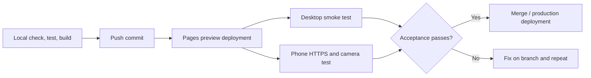

# Cloudflare Pages development

AR-DUINO is deployable as a static Vite site. Cloudflare Pages serves the build output over HTTPS; the visitor’s browser performs board rendering, camera access, OpenCV WebAssembly work, tracking, and overlay composition. The project does not need Pages Functions, Workers, a database, cross-origin isolation, or camera-frame upload.

> **Demo scope:** the hosted interface is intentionally sample-first. It loads the bundled Arduino UNO and MEGA 2560 data. Generic board-file upload is implemented below the UI layer but disabled in the current public experience.

## Git-connected Pages configuration

For a repository whose root is this project, use these values in **Workers & Pages → Create application → Pages → Connect to Git**:

| Setting | Value |
| --- | --- |
| Framework preset | Vite, or no preset with the values below |
| Build command | `npm run build` |
| Build output directory | `dist` |
| Node.js | `22.12.0` or newer |
| Root directory | Leave blank for this repository; set it only when AR-DUINO is nested inside another repository |

Before connecting a branch, reproduce the deployment build locally:

```powershell
npm.cmd install
npm.cmd run check
npm.cmd test
npm.cmd run build
Test-Path '.\dist\index.html'
Test-Path '.\dist\_headers'
Get-ChildItem '.\dist\vendor\opencv'
```

The last three commands confirm that the site shell, Pages headers, and OpenCV assets are present in the artifact that will be served. `dist/` is generated output; do not edit it by hand or commit it as source.

## What Pages adds to the demo

Pages gives a deployment an HTTPS origin, which is essential for mobile camera access. A local address such as `http://192.168.x.x:5173` is not a secure context on a phone. A Pages preview or production URL is.

The repository’s [`public/_headers`](../public/_headers) is copied to `dist/_headers`. It allows camera use by the same origin, disables microphone access, and gives `/vendor/opencv/*` a one-day cache lifetime with mandatory revalidation. This avoids a long-lived cached runtime after a custom OpenCV rebuild.

## Release and preview flow



Use a preview deployment for every change touching the AR worker, OpenCV assets, `_headers`, or camera flow. On the phone’s normal browser—not an embedded social or messaging browser—verify that the URL is HTTPS, the sample board loads, the camera prompt appears, calibration is touchable, and a lost pose fades or hides rather than remaining frozen.

## OpenCV pair integrity

The tracking worker relies on a matching custom JavaScript/WASM pair under `public/vendor/opencv/`. The current name contains an `arduino-r2` revision.

When regenerating the runtime:

1. Update the JavaScript file and `.wasm` file together.
2. Update every code reference to the new revision in the same change.
3. Run the local build and deploy a Pages preview.
4. Confirm the worker reaches `ready` and that both runtime requests succeed before promoting the build.

Do not replace only one member of the pair. A mismatched glue file and binary can surface as a worker-start failure that only appears after deployment or after a stale browser cache is involved.

## Test the production artifact on a phone

This route checks the built output before a Pages project is available. It differs from [the HMR workflow](local-https-camera-testing.md): this one serves `dist/`, so it is closer to the deployed artifact.

In one PowerShell window:

```powershell
npm.cmd run build
npm.cmd run preview:mobile
```

In a second window:

```powershell
cloudflared tunnel --url http://127.0.0.1:4173 --http-host-header localhost:4173
```

Open the printed `https://…trycloudflare.com` URL on the phone. The address is public, unauthenticated, temporary, and changes on every run. It stops working when either local process stops. A Quick Tunnel is valuable for build-and-camera testing, but it does **not** apply the Pages `_headers`; test a Pages preview before declaring deployment acceptance.

## Publish and recover safely

For a Git-connected project, a push to the production branch triggers deployment. Record the commit SHA and deployment URL used for the final mobile smoke test. If a deployment regresses, use Pages deployment history to roll back to the last known-good deployment, then fix the issue through a preview branch. A Git revert is appropriate when the source history should explicitly record the correction.

After any runtime update, use a fresh tab or hard refresh for validation. Existing open tabs can retain previous worker and asset state.

For the full handoff tutorial—including custom domains, dashboard steps, troubleshooting, and a portfolio release record—see [the Cloudflare Pages demo deployment tutorial](../../notes-and-analysis-dump/AR-DUINO/cloudflare-pages-demo-deployment.md) in the accompanying notes workspace.
