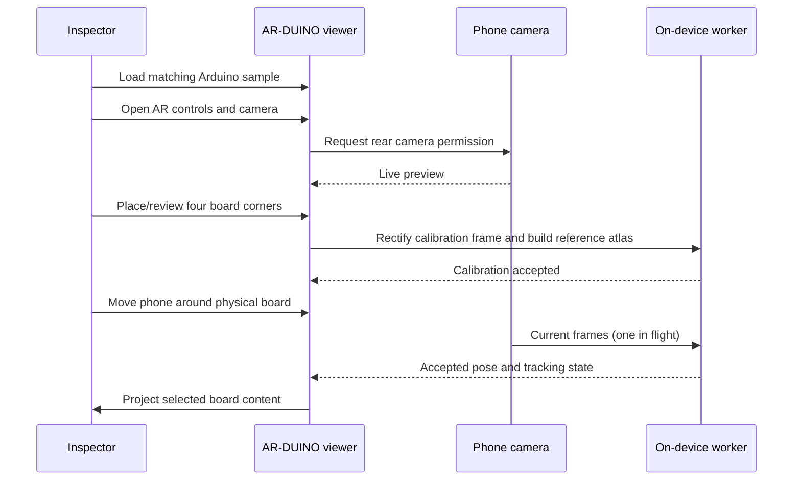

# Mobile AR workflow

This page is the practical walkthrough for demonstrating AR-DUINO with one of the bundled Arduino boards. It describes what the current prototype does today, including the parts that should be treated as a controlled showcase rather than a production inspection procedure.

<!-- Screenshot placeholder: add a phone calibration screen with the four numbered handles. Suggested path: assets/mobile-calibration.png -->

## Before you begin

You need a phone or tablet with a usable rear camera, an HTTPS URL for the application, and the matching physical Arduino UNO or MEGA 2560 board. Load the matching bundled sample in the app before starting AR.

For the first run, use diffuse light rather than a point light. Reflections on solder mask, silkscreen, or exposed pads are one of the quickest ways to reduce reliable features. Place the board on a visually calm surface, keep the whole outline in frame, and give the camera a moment to focus.

## Demonstration path

### 1. Load the board and orient yourself

Open the canvas menu and choose **Arduino samples**, then select the physical board you have on the table. Use the flat viewer first to confirm the board orientation, explore layers, and tap a component or net. The AR image uses the same renderer, selection, and visibility state as the flat canvas.

### 2. Open the camera

Open **AR controls** and choose **Open camera**. Grant Camera permission when the browser asks. If the browser reports that a secure connection is required, stop and use the [local HTTPS workflow](local-https-camera-testing.md) or a Pages preview URL; a phone cannot grant camera access to a normal LAN HTTP address.

The app requests a rear-facing camera where the browser supports that preference. It also attempts continuous focus and exposure controls when a device advertises them, but a rejected optional control does not make the camera unusable.

### 3. Place and review the four corners

Place the handles in this strict order: **top-left, top-right, bottom-right, bottom-left**. Put them on the physical PCB outline, not on a nearby connector, shadow, or silkscreen edge.

The calibration view includes a magnifier to help place a handle accurately. You may use **Detect edge** as a one-shot assist: it searches only around the current selection, proposes a new quadrilateral, and leaves final acceptance with you. It does not continuously track board edges and it does not silently apply its result.

Use the preview control to compare the projected artwork with the live board before committing. This is a review aid; it does not start tracking or alter the saved reference.

### 4. Apply calibration and let tracking settle

Applying calibration rectifies the chosen board into a front-facing canonical reference and creates a small synthetic view atlas. The on-device worker then combines descriptor-based recovery with optical flow between reliable anchors.

Move slowly at first. A healthy `TRACKED` state presents the filtered overlay. Brief failures move through `SUSPECT` or `RECOVERING`, where the overlay fades while the tracker searches again. A stale pose reaches `LOST` and is hidden rather than left frozen over the wrong location. Bring the board fully back into view; if recovery remains weak, recalibrate.

### 5. Use the inspection sequence

Open the inspection workspace to create a sequence from components and nets, or load the bundled sequence for the current board. A step can be marked **Pass** or **Flag**, and the sequence can be saved as JSON for later use.

With AR active, turn on **Isolate active sequence step in AR** in developer settings to project only the selected inspection context. A component step with a selected pin follows that pin’s net when it can be resolved; a net step keeps the selected net and directly attached components. The flat viewer itself remains unchanged after the temporary AR source is rendered.

## What the tracking states mean

| State | What you see | What to do |
| --- | --- | --- |
| `TRACKED` | A current, filtered overlay. | Continue the inspection. |
| `SUSPECT` | Trust is reducing after a weak update. | Hold steady and keep the whole board visible. |
| `RECOVERING` | The overlay fades as broader recovery searches run. | Reduce glare/motion and return toward a familiar view. |
| `LOST` | The stale overlay is hidden. | Reframe the board or calibrate again. |

## Diagnostics and responsible capture

Developer settings can show tracked feature points and quality information. Cyan points are detected features, amber rings are descriptor matches, magenta crosses are points that passed forward/backward optical-flow validation, and green rings are RANSAC inliers for the accepted pose.

Use diagnostics to understand a failed condition, not to tune thresholds around one fortunate run. The browser performs camera-frame processing locally; tracking diagnostics are designed not to expose camera frames or board-file contents. For implementation-level explanations of the quality gates, see [AR tracking architecture](ar-tracking-architecture.md).

## What to capture for the portfolio

<!-- APNG placeholder: add a 6–10 second loop showing calibration, a stable overlay, and a sequence-step change. Suggested path: assets/ar-demo.apng -->

Capture a short session in stable, diffuse lighting. A strong portfolio sequence shows the flat viewer first, then the four-corner calibration, a deliberate change of viewpoint while the overlay remains registered, and finally a selected component or isolated sequence step. Avoid presenting a frozen or weak pose as proof of live tracking; the state treatment is part of the project’s safety design.
